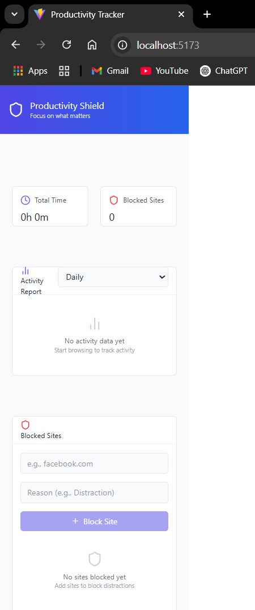
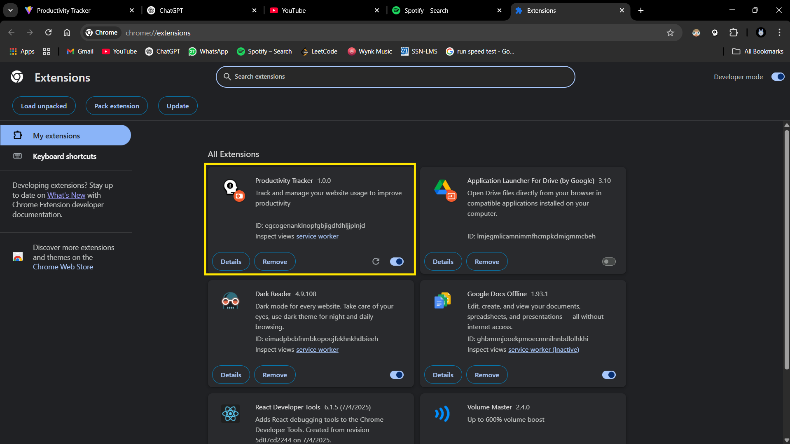
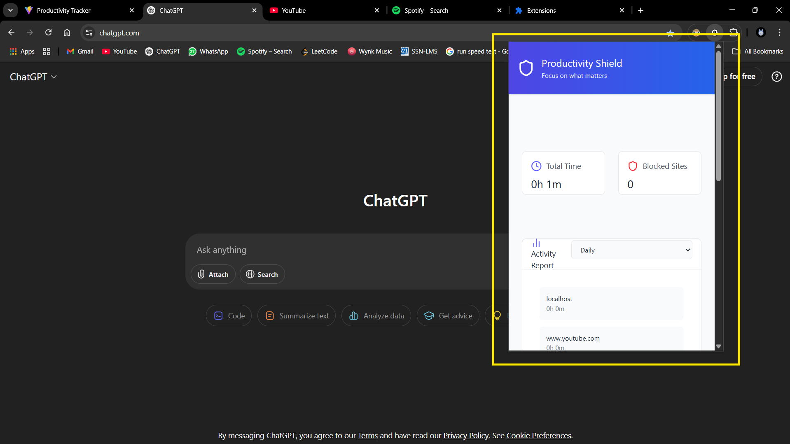
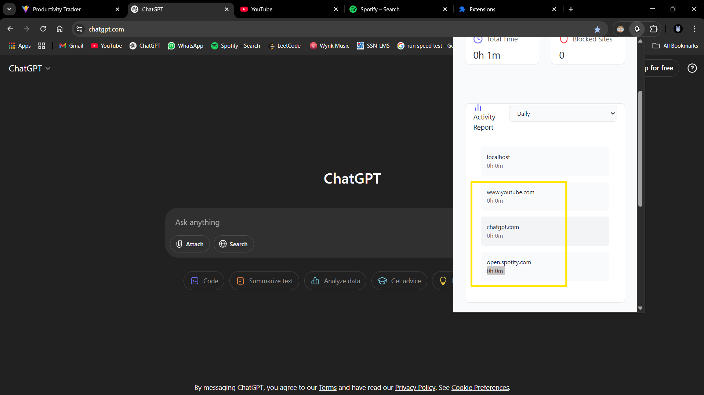
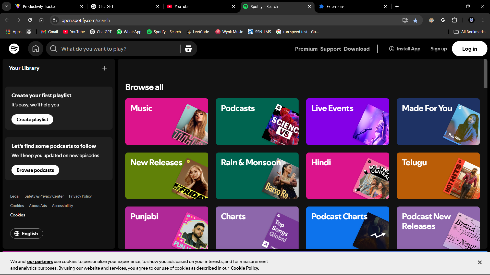
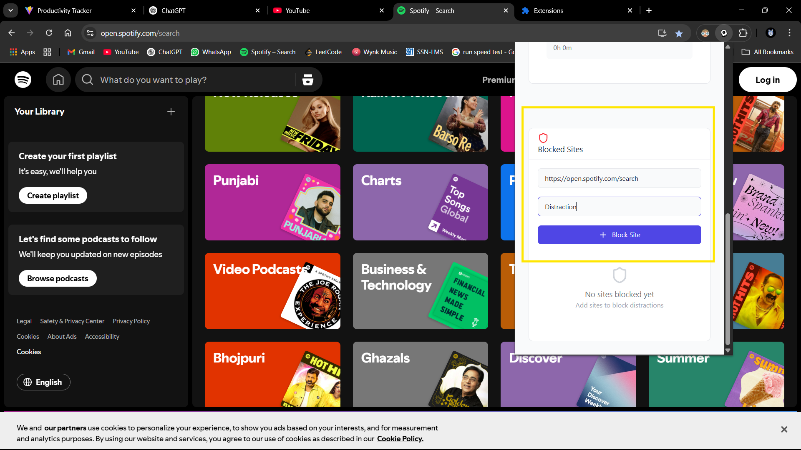
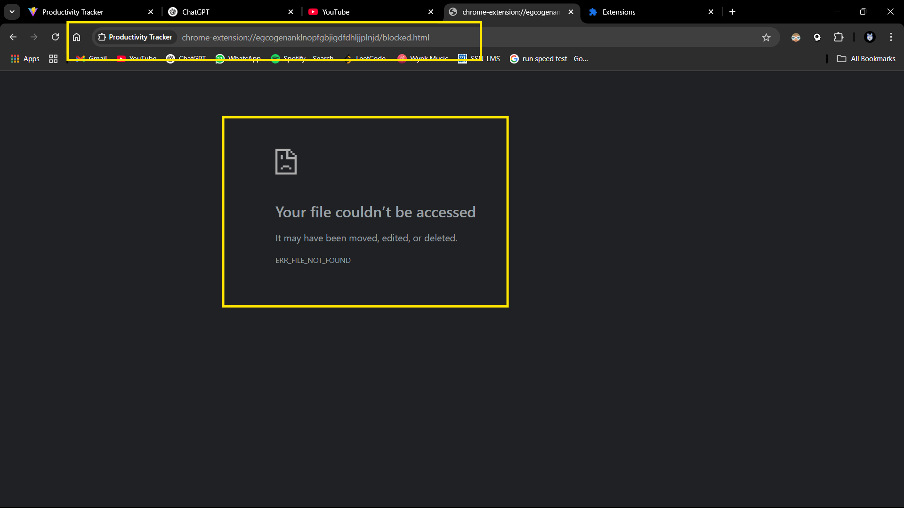
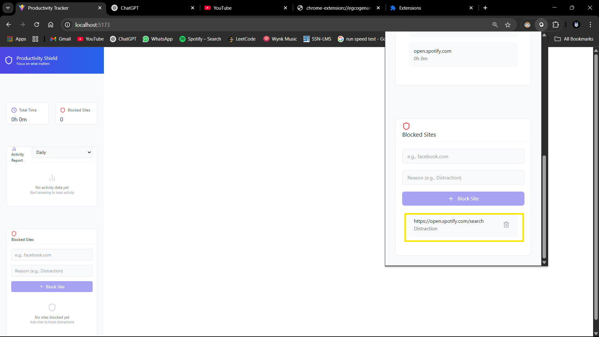

# MERN Stack Web Development  
______________________________________  
**COMPANY** : CODTECH IT SOLUTIONS  
**NAME** : SUDHIR K  
**INTERN ID** : CT08DM1071  
**DOMAIN** : MERN STACK WEB DEVELOPMENT  
**DURATION** : 8 WEEKS  
**MENTOR** : NEELA SANTOSH  

---

## 📝 Internship Work Summary

As part of my internship at **CodTech IT Solutions**, I developed a full-stack **Productivity Tracker Chrome Extension** that empowers users to stay focused online by monitoring their website usage and blocking distractions in real-time. The goal of this project was to apply my knowledge of the **MERN stack** in building a browser-based productivity tool that functions both as a Chrome Extension and as a web-connected backend system.

To start, I identified the problem statement—modern internet usage often leads to distractions that reduce productivity. The solution was a browser extension that not only tracks time spent on websites but also allows users to block time-wasting domains, and view insightful reports about their browsing behavior.

The frontend was built using **React**, adapted to comply with **Chrome Extension Manifest V3** requirements. I created components for the popup UI, including real-time usage stats, a website blocking interface, and feedback alerts. The frontend is bundled using Vite and configured for Chrome Extension compatibility, ensuring it could be deployed seamlessly in the browser.

On the backend, I developed a **REST API** using **Node.js**, **Express**, and **MongoDB**. The backend handles storing user activity, retrieving usage analytics, and managing a blocklist database for each user. I implemented endpoints to log time spent per domain, generate daily and weekly usage reports, and update the list of blocked sites.

To sync data across sessions or devices, I implemented a system using a unique **Device ID**, allowing all browser actions to be associated with a consistent record in MongoDB. Time tracking was performed using background scripts in the extension, which monitored active tabs and sent usage data to the server at regular intervals.

I tested the extension extensively by simulating various browsing behaviors, blocking/unblocking workflows, and verifying reports accuracy. The blocking feature works by redirecting users to a custom "blocked" warning page when they try to visit listed websites, enhancing self-regulation.

This project gave me valuable experience with browser APIs, background service workers, and integrating real-time tracking into a Chrome environment. It also strengthened my knowledge of full-stack development, especially in areas like API security, state management within extensions, and database design for time-series data.

By the end of the internship, I successfully deployed both the frontend extension and the backend server, creating a fully functional and installable Chrome Extension. This project significantly improved my ability to think like a full-stack developer and design solutions that combine browser technologies with cloud-based services.

---

## 🖼️ Demo Screenshots

Visual walkthrough of the Productivity Tracker Extension:

---

### 🏠 1. Home Page  
UI and Template of the Extension  


---

### 🔧 2. Manage Extensions (chrome://extensions)  
Load and manage your extension from here.  


---

### 🧩 3. Chrome Extension Popup  
The floating window that shows real-time website tracking and quick actions.  


---

### ⏱️ 4. Track Time Spent on Websites  
View which websites are currently open and how long you've spent on them.  


---

### 🔒 5. Website Blocking Flow

#### a. Before Blocking (Normal Website View)  
For Example: https://open.spotify.com/search  


#### b. Blocking the Website (Using the Extension UI)  


#### c. After Blocking (Blocked Warning Page)  


#### d. Blocked Sites (List of Sites which are blocked)  


---

# Productivity Tracker Chrome Extension

A **Chrome extension** that helps you improve focus by tracking your website usage and blocking distractions.

---

## 🚀 Features

- ⏱️ Track time spent on websites  
- 🚫 Block distracting websites in realtime 
- 📊 View daily & weekly productivity reports  
- 🔄 Sync across devices using a unique device ID  

---

## 🗂️ Project Structure

- **Frontend:** Chrome Extension (React + Manifest v3)  
- **Backend:** Node.js + Express + MongoDB (REST API)  

---

## 🔧 Getting Started

### 1. Backend Setup

```bash
cd backend
npm install
# Add your MongoDB connection string to .env
npm run server
```

### 2. Frontend (Chrome Extension)

```bash
cd frontend
npm install
npm run build
```

Then:
1. Open Chrome → `chrome://extensions`
2. Enable **Developer mode**
3. Click **Load unpacked** → select `frontend/dist` folder

---

## 📡 API Overview (Simplified)

- **/api/website-usage** – Save and fetch website usage  
- **/api/website-usage/report** – Get daily/weekly reports  
- **/api/blocked-sites** – Add, update, and remove blocked websites  

---

## 📌 Dev Tips

- Backend dev server: `npm run server`  
- Frontend dev mode: `npm run dev`  
- Build extension: `npm run build`

---

Made by **Sudhir**💖 
[GitHub Profile](https://github.com/SudhirKannan)
